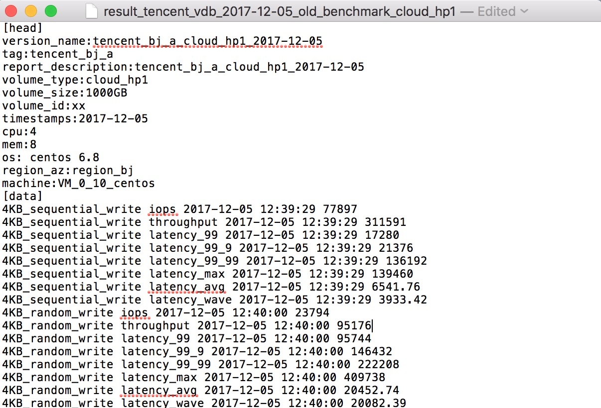

## 业务需求 ##

块存储服务推出后，需要针对各种产品宣称性能做基准性能评估。存储领域中性能评估指标主要分为三类IOPS、throughput、latency

目前业界对于块存储的产品划分情况如下:

|  产品类型      | 性能特点 |  应用场景  |  主流厂商支持情况  |
| :-------      | :---- | :--- | :---- |
| near local    | >= 本地ssd盘性能 | 大型OLTP数据库/NoSQL数据库/ELK分布式日志 | 阿里云ESSD |
| SSD云盘 |  20000IOPS左右 | I/O密集型应用/中型关系数据库/NoSQL数据库 | 主流厂商均支持 |
| 高效云盘 |  性能够用就好，5000IOPS左右 | 开发与测试业务/小型负载数据库/系统盘 | 主流厂商均支持 |
| 普通云盘 |  sata介质，吞吐优化型500MBps，冷存储250MBps以下 | 大数据/数据仓库/日志处理 | aws划分更细致，阿里云已淘汰 |

## 分层测试框架 ##

分布式块存储性能测试考量需要覆盖以下的层次:

1. 系统网络性能、物理磁盘性能测试
2. 存储核心系统读写性能测试，stress_tool、data_consistency_tool
3. 宿主机上云盘性能、以及虚拟机上的云盘性能，PTS测试模型，fio
4. 设备上文件系统性能测试，filebench，iozone等等
5. 实际应用负载测试，sysbench OLTP、分布式数据分析框架IO负载仿真
6. 用户常用操作的易用性

块存储性能测试需要从两个视角看：

* 用户维度：针对系统中单一卷实例可以获得稳定且可预期的性能，更多关注上述3 ~ 6的测试层次，本文主要讲解第3个层次的测试设计
* 集群维度：针对集群可服务能力的性能评估，保障系统整体稳定可控，更多关注上述1 ~ 2的测试层次

## PTS测试模型 ##
**PTS：** Solid State Storage Performance Test Specification 
SNIA固态存储性能测试标准，相关文档参见 [SSS_PTS_2.0.1.pdf](https://www.snia.org/sites/default/files/technical_work/PTS/SSS_PTS_2.0.1.pdf)

本文测试设计主要参考上述文档，并针对云环境做了相应适配

### 测试步骤 ###

根据 PTS 规范，SSD 性能测试需要经过以下四个步骤：

1. 净化（purge）：通过擦除数据，将 SSD 置于接近 FOB 状态。
2. 事先准备工作负载（WIPC）：写入规定的数据到整个 SSD，帮助其达到稳态。
3. 正式测试之前的准备工作（WDPC）：循环运行测试，直到 SSD 进入稳态。
4. 测试：当 SSD 进入稳态时开始测试。

备注:

*FOB:* Fresh of Box，新鲜出盒，即硬盘刚买来的状态  
*稳态:* 性能波动范围小于预先设定的阈值
 

### 测试项 ###
#### IOPS测试 ####
测试在不同block size与不同的read/write 比的混合下随机IO的性能  
block size：100/0, 95/5, 65/35, 50/50, 35/65, 5/95, 0/100  
read/write：1024KiB, 128KiB, 64KiB, 32KiB, 16KiB, 8KiB, 4KiB, 0.5KiB   
磁盘IO的范围：100% volume size

（1）purge  
（2）WIPC：128k顺序写2倍的磁盘空间  
（3）WDPC：上述工作负载（bs，r/w） loop运行  
（4）稳态判定：取相邻4轮的4kb 随机 0/100的iops，相对均值上下浮动在10%以内，即达到稳态，即取这四轮的测试数据为稳态窗口

测试数据，取稳态窗口的均值

#### Throughput测试 ####
测试在稳态的128k与1m的顺序读与顺序写的吞吐  
磁盘IO的范围：100% volume size

（1）purge  
（2）WIPC：128k顺序写或1M的顺序写2倍的磁盘空间  
（3）WDPC：bs(128k,1M)和rw(100/0, 0/100) 顺序IO，loop，记录吞吐量  
（4）稳态判定：取相邻4轮的吞吐，相对均值上下浮动在10%以内，即达到稳态，即取这四轮的测试数据为稳态窗口

测试数据，取稳态窗口的均值

#### 延迟测试 ####

测试在3种block sizes（0.5k，4k和8k），与三种读/写 比（100/0，65/35，0/100）混合下IO响应时间  
磁盘IO的范围：100% volume size

（1）purge  
（2）WIPC：128k顺序写2倍的磁盘空间  
（3）WDPC：bs(0.5k, 4k, 8k)和rw(100/0,  65/35, 0/100) 随机IO，loop，记录最大延迟与平均延迟  
（4）稳态判定：取相邻4轮的平均延迟（0/100，4k），相对均值上下浮动在10%以内，即达到稳态，即取这四轮的测试数据为稳态窗口

测试数据，取稳态窗口的均值

#### 稳定性测试 ####

测试SSD性能是随着时间以及写入量的增加是如何变化的（1min的检测穿插着30分钟的WAST测试）

（1）purge  
（2）4k的随机写（100%），持续写入达到4倍的磁盘大小或者达到24h或者达到5轮的稳态（满足其一即可）  
（3）iostat统计磁盘读写性能数据，取fio延迟波动方差的数据

## 测试工具 ##

代码路径: [https://github.com/ksk0014/block-storage-benchamrk](https://github.com/ksk0014/block-storage-benchamrk)

## 效果展示 ##

测试结果保存在文件中，格式如下图:

